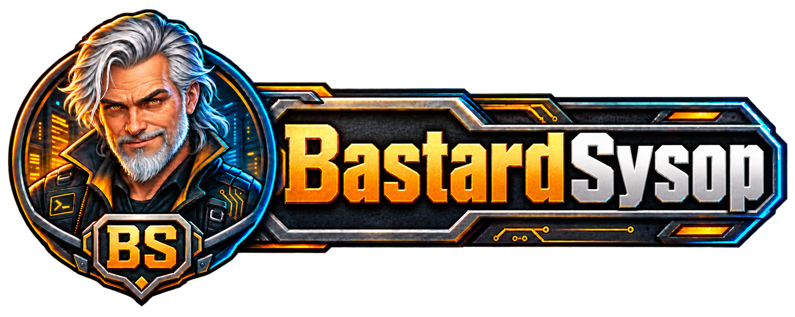

  

# Hey, I'm IronWolve 🤠

**Old Internet never died.**

I build and port desktop apps, retro chat experiments, internet-radio apps, and small games for Windows, Linux, OSX.

---

## Active Projects

[MaxChat](https://github.com/IronWolve/MaxChat) - Modern IRC client with deep customization and optional Comic Chat-compatible comic mode.

[StreamTuner-ng](https://github.com/IronWolve/StreamTuner-ng) - Reimagined internet-radio browser for modern Python/Qt, inspired by the classic StreamTuner idea.

[Simple Tower Defense 2D](https://github.com/IronWolve/SimpleTowerDefense) - Endless maze-building tower defense game made in Godot, with towers, traps, bosses, saves, and generated maps.

[BS Notepad](https://github.com/IronWolve/BS-Notepad) - A desktop workspace for notes, Markdown, source files, and images.

[BS Podcasts](https://github.com/IronWolve/BS-Podcasts) - A desktop podcast player with subscriptions, downloads, listening queues, and playback controls.

[yue2-kit](https://github.com/IronWolve/yue2-kit) - A YuE2 install kit with a studio interface, LoRAs, VAEs, and voice/style sliders.

---

## Games & Ports

[LinCity-NG Godot Port](https://github.com/IronWolve/lincity-ng-godot-port) - Fan-made Godot port of the classic LinCity-NG city/economy sim.

[Simple Solitaire](https://github.com/IronWolve/Simple_Solitaire) - Clean Godot solitaire with Klondike and Spider.

[wavmaster](https://github.com/IronWolve/wavmaster) - Audio mastering tool with analysis, A/B comparison, and reference mastering workflow.

---

## What I Like Building

- IRC, radio, and old-school internet tools
- Desktop apps with real options
- Retro games and Godot experiments
- Audio utilities and media tools
- Local-first software that does not need a cloud account to be useful

---

## Philosophy

> Old Internet never died.

The best parts of computing are still here: IRC, radio streams, small tools, local apps, weird experiments, and software made by people who actually use it.
